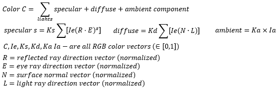
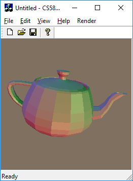
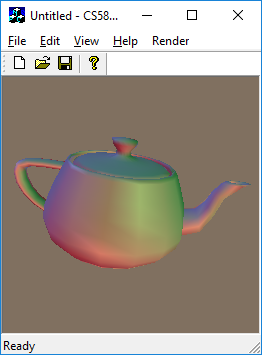

# Shading

This is an implementation of shading. Shading is to apply color to the 3D object surface. To choose color of a pixel, it requires light, its direction, and its intensity. Thus, these three elements are provided as constant values or vectors. The color reflection is consisted of specular, diffuse, and ambient components. This implementation computes colors via vector dot with normals and direction of light, its reflection direction, and eye directions.Color equation as follow:



## Shading Algorithms

This implements three shading algorithms: Flat, Gouraud, Phong.

### Flat Shading

Flat shading computes color by use the normal of a face of a triangle. The normal of a face of a triangle is a result vector of dot product of two vectors of a triangle. Thus, all pixel in the triangle have same color since the normal of all pixel is same.



### Gouraud Shading

Gouraud shading computes colors each three vertice of a triangle. And it interpolates colors of other pixels using thses three color vectors.



### Phong Shading

The 3D model provides normals per every vertices. So, we could compute color at these vertices as the Gouraud did. Phong shading computes color at every pixels. Thus, to do this, we should computes normals at every pixels since the 3D model do not provide. Phong shading interpolates normals at every pixels and computes colors. As a result, the specular is rendered in phong shading.


## The repository includes:
* Source code
* Sample datasets
* Sample screen shots


## Datasets
### Input

The input file named rects contains rectangles information. Each line is consisted of seven numbers. The first two numbers represent top left corner cordination (X,Y) of rectangle, following two numbers mean bottom right corner cordination (x,y) of rectangle, and following three numbers are the RGB color values. The media contents consist of series of image files. Each image file is .RGB where the resolution is 352x288 containing 352x288 red bytes, followed by 352x288 green bytes, floowed by 352x288 blue bytes.

### Output

The output file is .PPM file format which has an ascii header followed by 8-bit binary pixel color values in raster order (top-left to bottom-right). For example the header is `P6 255 256 255\n` `RGBRGBRGB...` produces a 256x256 image.


## Result Screen shot


## Building Environment
* Microsoft Window 10
* Microsoft Visual Studio Community 2015 Version 14.0.25431.01 Update 3


## Compile and Run
```bash
Set running configuration to Release
Build - Build Solution
> %(Solution Dir)\Release\CS580HW2.exe
Render - RunRender
```


## Status

This is the 4th assignment of CSCI-580 3D Graphics and Rendering, 2018 fall

Version 1.0
