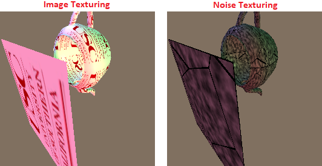

# Texture

In the shading project, it used constant color vctors. But the real objects has its own texture. So, it should use texture colors at each pixel on the 3D object. In this case, it uses (u,v) coordination to find colors for the pixels. Therefore, it should find perspective (u,v) coordination corresponding coordination of 3D object. This example uses image texture and noise pattern which is generated by dynamically. This example generates wolf noise pattern.

## Result Screen shot


## The repository includes:
* Source code
* Sample datasets
* Sample screen shots


## Datasets
### Input

The input file named rects contains rectangles information. Each line is consisted of seven numbers. The first two numbers represent top left corner cordination (X,Y) of rectangle, following two numbers mean bottom right corner cordination (x,y) of rectangle, and following three numbers are the RGB color values. The media contents consist of series of image files. Each image file is .RGB where the resolution is 352x288 containing 352x288 red bytes, followed by 352x288 green bytes, floowed by 352x288 blue bytes.

### Output

The output file is .PPM file format which has an ascii header followed by 8-bit binary pixel color values in raster order (top-left to bottom-right). For example the header is `P6 255 256 255\n` `RGBRGBRGB...` produces a 256x256 image.


## Building Environment
* Microsoft Window 10
* Microsoft Visual Studio Community 2015 Version 14.0.25431.01 Update 3


## Compile and Run
```bash
Set running configuration to Release
Build - Build Solution
> %(Solution Dir)\Release\CS580HW5.exe
Render - RunRender
```


## Status

This is the 5th assignment of CSCI-580 3D Graphics and Rendering, 2018 fall

Version 1.0
