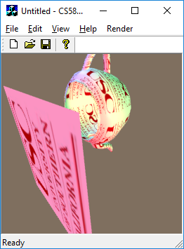

# Anti-aliasing

When the resterizer decides pixels to draw, the aliasing effect is occurred. Also, perspective increases aliasing effect. The (X,Y,Z) coordination of model uses floating point for each (X,Y,Z) value. However, the screen pixel coordination uses integer value. Thus, it is impossible to render correct models on the model since round up or down are occurred. This interpolation causes aliasing. At the worst case, if there is a triangle and it is small enough, no pixel draws the triangle. To prevent aliasing, the this uses supersampeling. On the other word, this example uses low-pass filter. 


## The repository includes:
* Source code
* Sample datasets
* Sample screen shots


## Datasets
### Input

The input file named rects contains rectangles information. Each line is consisted of seven numbers. The first two numbers represent top left corner cordination (X,Y) of rectangle, following two numbers mean bottom right corner cordination (x,y) of rectangle, and following three numbers are the RGB color values. The media contents consist of series of image files. Each image file is .RGB where the resolution is 352x288 containing 352x288 red bytes, followed by 352x288 green bytes, floowed by 352x288 blue bytes.

### Output

The output file is .PPM file format which has an ascii header followed by 8-bit binary pixel color values in raster order (top-left to bottom-right). For example the header is `P6 255 256 255\n` `RGBRGBRGB...` produces a 256x256 image.


## Result Screen shot



## Building Environment
* Microsoft Window 10
* Microsoft Visual Studio Community 2015 Version 14.0.25431.01 Update 3


## Compile and Run
```bash
Set running configuration to Release
Build - Build Solution
> %(Solution Dir)\Release\CS580HW6.exe
Render - RunRender
```


## Status

This is the 6th assignment of CSCI-580 3D Graphics and Rendering, 2018 fall

Version 1.0
