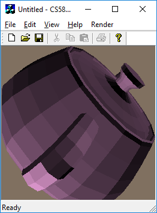

# 3D Graphics And Rendering

This is an implementation of 3D graphic rasterization and related features on MFC. This program resterizes 3D polygon datasets to 2D image. In addition, this apply transformations such as rotation, translation, and scaling; shadings such as Flat, Gouraud and Phong; texturing; anti-aliasing. Each features are implementated at different projects. 

* ## [Frame Buffer](https://github.com/jungbomp/3D_GraphicsAndRendering/tree/master/01_FrameBuffer)

This is an implementation of frame buffer.


* ## [Rasterize](https://github.com/jungbomp/3D_GraphicsAndRendering/tree/master/02_Rasterization)

This is an implementation of Scanline resterization. It uses slop equation for Z-buffering.



* ## [Transformations](https://github.com/jungbomp/3D_GraphicsAndRendering/tree/master/03_Transformations)

This is an implementation of transformations such as rotation, translation, and scaling. This forms graphic pipeline (Model space to screen space).


* ## [Shading](https://github.com/jungbomp/3D_GraphicsAndRendering/tree/master/04_Shading)

This is an implementation of shading such as Flat, Gouraud and Phong shading. Flat shading decides color by its face normal. [Gouraud shading](https://en.wikipedia.org/wiki/Gouraud_shading) interpolates color. [Phong shading](https://en.wikipedia.org/wiki/Phong_shading) interpolates normals.


* ## [Texturing](https://github.com/jungbomp/3D_GraphicsAndRendering/tree/master/05_Texturing)

This is an implementation of texturing with u,v coordination. It uses a texture image. Also, it generates a wolf noise pattern image for texturing.


* ## [Anti-aliasing](https://github.com/jungbomp/3D_GraphicsAndRendering/tree/master/06_Antialiasing)

This is an implementation of anti-aliasing. When the resterizer decides pixels to draw, the aliasing effect is occurred. Also, perspective increases aliasing effect. To prevent aliasing, the this uses supersampeling.


### The repository includes:
* Source code
* Sample datasets
* Sample screen shots

### Datasets

```Input```

The input file named rects contains rectangles information. Each line is consisted of seven numbers. The first two numbers represent top left corner cordination (X,Y) of rectangle, following two numbers mean bottom right corner cordination (x,y) of rectangle, and following three numbers are the RGB color values. The media contents consist of series of image files. Each image file is .RGB where the resolution is 352x288 containing 352x288 red bytes, followed by 352x288 green bytes, floowed by 352x288 blue bytes.

```Output```

The output file is .PPM file format which has an ascii header followed by 8-bit binary pixel color values in raster order (top-left to bottom-right). For example the header is `P6 255 256 255\n` `RGBRGBRGB...` produces a 256x256 image.


### Result Screen shot


## Building Environment
* Microsoft Window 10
* Microsoft Visual Studio Community 2015 Version 14.0.25431.01 Update 3


### Status

These projects are assignments of CSCI-580 3D Graphics and Rendering, 2018 fall

Version 1.0

